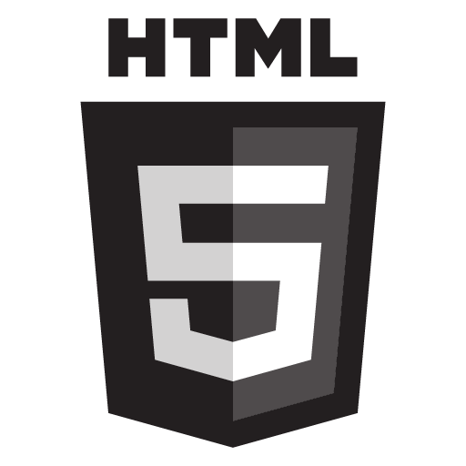

# Build a Website from a Template

1. Start here: [Templated.co](https://templated.co)

2. As a team, choose a template to download.

    
Mousing over the template offers the option to download
    

3. Unzip the contents into your local directory.

4. Load these files into a source code repository, such as Git (ask your mentor for help), or use a shared folder so the entire team can collaborate.

5. Make sure each team member has the updated code on their local device.

6. Decide how you want to add to and embellish your site. Divvy up tasks among your team members.

7. Modify the content (including but not limited to the _index.html_ file and its related CSS file). Some elements you might want to include:

    *   Headings (1-6)

    *   Paragraphs

    *   Lists (bulleted or numbered)

    *   Tables or forms

    *   Although you can experiment with inline formatting (remember `` and `<em></em>`?) remember that most of your formatting should happen in the CSS file.
    
        
##### Need an HTML Refresher?

Check out this HTML cheat sheet: [websitesetup.org/HTML5-cheat-sheet.pdf](https://websitesetup.org/HTML5-cheat-sheet.pdf)
        
    
        
##### Need a CSS Refresher?

Check out our CSS cheat sheet at the end of the CSS session's worksheet: [codingandcocktailskc.gitbooks.io/session-2-css/content/references/css_cheat_sheet.html](https://codingandcocktailskc.gitbooks.io/session-2-css/content/references/css_cheat_sheet.html)
        

8. Be sure to test all the functions of your page - hyperlinks, images, and buttons and ensure that they work correctly and have some functionality when the user interacts.

9. Try adding some event handlers to your page - maybe include a button that reacts when you click it by displaying a message.

    
##### Looking for a refresher?

Revisit the JavaScript worksheet for an example of a click handler: 
[bit.ly/cncjavascriptwork](https://bit.ly/cncjavascriptwork)
    

10. **Extra Credit:** Add a section to your web site that includes an image slider (use the [tiny-slider](https://github.com/ganlanyuan/tiny-slider) library)

    
##### Need Inspiration?

Check out some examples with configuration settings: 
[tiny-slider/demo](https://ganlanyuan.github.io/tiny-slider/demo/)
    

11. Feel free to add more pages to your site as well!  Some ideas might include:
    
    * A contact page

    * An about the team page
    
    * Etc!

