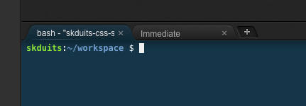

# Prep Work


If this is your first time joining us for Coding & Cocktails, you'll want to [install our tools](http://bit.ly/CnCTheTools) before you go any further.


### 1. <a href="https://kcwit.slack.com/messages/C0BGBKGG6">Click Here to Open Slack</a>

If you have a tip that helped you with a step on the worksheet, you can easily share it with the group in Slack. Or if there are any issues with the worksheet [we make typos or there's an update to a tool that we didn't catch before the session], we may post updates in Slack. Plus, after class is over, Slack becomes a tool for you to gain access to mentors as you go through the homework, or any other questions that arise.

### 2. Pick a theme

A theme will help focus your work. This can be anything you can dream up but if you need some inspiration, here are some ideas to get your team talking. You don’t have to limit yourself to these.

* What you have learned at Coding & Cocktails

* Favorite Sports Team

* Favorite Hobby

* Team Website: Introduce who you are & what your team is about

* Build out a bar website with a tasty cocktail menu

* Personal portfolio site for craft projects

### 3. Draw a picture of what you want your site to look like

Before you start writing code, you should have an idea of the end game. Draw it out on paper so that your entire team knows what you are working towards. This can be both the look and feel and how the user should interact with and navigate the site, sometimes called a sitemap.

### 4. Set up a GitHub repository

As a team, create a new GitHub repository.

Add all team members as collaborators on the repository including your mentor/technical architect.


##### Git to it!
Revisit the version control worksheet: [http://bit.ly/CnCAprWork](http://bit.ly/CnCAprWork)



Not sure how to add Git collaborators? [http://bit.ly/CnCGHCollab](http://bit.ly/CnCGHCollab)


Make sure each team member has the repository cloned to your local device in your CodingAndCocktails folder you created when you worked through the tools document.


#### Command line woes?
Revisit the command line worksheet from March:
[bit.ly/CnCMarWork](http://bit.ly/CnCMarWork)
  - Your home directory is:
    - Mac: `/users/<yourUsername>`
    - Windows: `C:/Users/<yourUsername>`
  - Command to change folders: `cd <folderToGoTo>`
  - Command to make a folder: `mkdir <newFolder>`
  - You can also use **~** as a shortcut in your CLI for your home directory: ``cd ~``


### 5. Choose one of four project models

For more details on how to proceed with each option, view that specific options page in the GitBook.

* **Option 1:** Using a template from [Templated.co](https://templated.co/) as a starting point, download the template and modify and style using HTML and CSS. Add some interactivity with JavaScript too!

* **Option 2:** Use a Yeoman scaffold like the one we used in the Front End Architecture session to build out your site.

  
##### Yeoman to the rescue!
Revisit the front-end architecture worksheet: [http://bit.ly/CnCMayWork](http://bit.ly/CnCMayWork)
  

* **Option 3:** Build out a single page application similar to the trivia app we built in the session on SPA’s. You could start with the framework of the trivia app from the session worksheet and expand on it, or spin your own!

  
##### Single Page Applications
Revisit the SPA worksheet: [http://bit.ly/CnCOctWork](http://bit.ly/CnCOctWork)
  
  
* **Option 4:** Build out your code portfolio by making a contribution to an Open Source project.  Having this on your resume and the experience working with other developers on an existing project is a great way to show your skills and learn what it is like to be a developer on an existing project!

### 6. Divvy up the work and start building!


If you're using a Chromebook, see the Cloud9 instructions below.


How you divvy up responsibilities is up to your team and what feels comfortable. Ask your mentor/technical architect about pair programming vs. Git collaboration. You will need to start with a GitHub repository for each project no matter what model you’ve chosen. This will make your team collaboration much easier!

<!--sec data-title="Introduction" data-id="section0" data-show=true ces-->
 
Insert markdown content here (you should start with h3 if you use heading).
 
<!--endsec-->

<!--sec data-title="Chromebooks Only: Cloud9 Instructions" data-id="section1" data-show=true data-collapse=true ces id="chromebook"-->

1. Sign up for an account at [c9.io](https://c9.io)

  Note: It will ask you for credit card information, but you will not get charged for anything since we do not use features of Cloud9 that cost money. Ask a mentor for the Coding & Cocktails card for Cloud9.

2. Confirm your account from your email and log in to Cloud9.

3. Select **Workspaces** from the left side panel if you are not already there.

4. Choose **Create a new workspace**.

5. Add a name for your workspace - it can be anything you like. You do not need a description, but feel free to add one if you like.

6. Leave your workspace as **Public**.

7. In the Clone from Git or Mercurial URL section, add the link to the GitHub repository that your team created in Step 4 above.

8. In the template section select the appropriate option (likely either HTML 5 or Node.js).

9. Click on the **Create Workspace** button.

  Cloud9 will take a minute and create your workspace here.

10. When the workspace opens, click on the small x on the right side of the tab that says `[M]/README.md` to clear your workspace.

12. We need to update the version of Node.js that Cloud9 uses by default. We'll use a tool called **Node Version Manager** to use version 8. In the terminal section of your workspace (that's the bottom portion with the `~/worspace $` prompt), type: `nvm install 8`

  

 

 To make the terminal section bigger, hover over the top line of the terminal section with your mouse - it will change to an up-down arrow icon and then you can drag up which will also make the file editing area smaller.
 

13. If we leave Cloud9 and come back to this workspace, the version of Node.js resets, so let's change the default. In the terminal, type: `nvm alias default 8`

16. Continue with building your application!

<!--endsec-->

